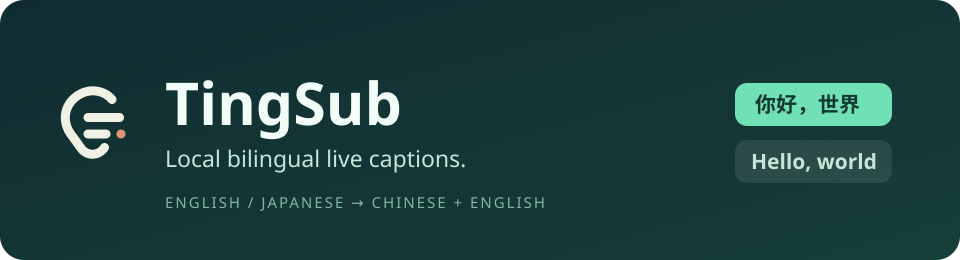
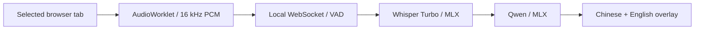

<p align="center"></p>

<p align="center">
  <a href="https://github.com/yeshan333/tingsub/actions/workflows/ci.yml"></a>
  <a href="LICENSE"></a>
  
  
</p>

<p align="center"><strong>English</strong> · <a href="README.zh-CN.md">简体中文</a></p>

# TingSub · 听桥

Turn English and Japanese browser audio into **Chinese + English live captions**, with speech recognition and translation running on your Mac. Choose **Chinese + original** to keep Japanese speech in Japanese.

TingSub is an early-stage Chrome extension and local MLX service for Apple Silicon. It captures the tab you select, preserves audio playback, and displays draggable captions over the page, including YouTube fullscreen. It does not require existing YouTube captions.

**Local inference after setup.** No cloud API, account, audio upload, telemetry, or automatic recording. Installation and the first model download need network access; the video website still uses its own network connection.

> **License scope:** TingSub code is MIT. The default Qwen2.5-3B translation weights use the **Qwen Research License**, with separate usage restrictions. They are not covered by MIT. Read [model licenses](docs/en/models.md) before using or distributing the models.

## What it does

- English / Japanese input, including automatic language detection per segment.
- Optional recognition drafts, early Chinese output, then complete bilingual captions.
- Bounded queues and visible overload/rejection counts, so slow inference cannot silently accumulate an endless backlog.
- Per-segment first-text, first-Chinese and speech-end latency; a local pairing code protects the inference connection.
- One active tab at a time, without microphone access.

The current extension UI and most runtime messages are in Simplified Chinese. All user and contributor guides are available in **English and Simplified Chinese**. UI localization is a planned follow-up; documentation languages do not change caption languages.

## Quick start

You need an **Apple Silicon Mac running macOS 14+**, **Chrome 116+**, and [uv](https://docs.astral.sh/uv/getting-started/installation/). 16 GB RAM is recommended; the two default model snapshots total roughly 2.2 GB, plus dependencies and caches. Intel Macs, Windows, Linux and Firefox are not supported inference targets in this version.

```sh
git clone https://github.com/yeshan333/tingsub.git
cd tingsub
uv sync --frozen --python 3.12
uv run --frozen tingsub prepare
uv run --frozen tingsub pair
uv run --frozen tingsub serve
```

Save the pairing code printed by `pair`. Wait for `Application startup complete` and keep the terminal open. On macOS you can also run `./setup.command`, then `./start.command`.

1. Open `chrome://extensions`, enable **Developer mode**, and choose **Load unpacked** → this repository's `extension/` directory.
2. Pin **TingSub · 听桥**. Open its popup → **本机配对** (Local pairing), then paste the pairing code.
3. Play a livestream. Select **英语** (English) or **日语** (Japanese), then click **为当前标签页开启字幕** (Start captions for this tab).
4. Use **停止** (Stop) or the caption panel's × button to stop. Navigating, refreshing or closing the captured tab stops the session too.

The service listens on `127.0.0.1:18765`. See the [installation guide](docs/en/installation.md) for updates, settings and uninstalling, or [troubleshooting](docs/en/troubleshooting.md) if it cannot connect. No Chrome Web Store listing or standalone installer is provided yet.

## How it works



Speech is submitted after a pause, or split at about 3 seconds during continuous speech. Drafts can appear earlier. A complete Chinese field can display before the English translation finishes. See [architecture and protocol](docs/en/architecture.md).

## Performance and limitations

Latency depends on speech length, drafts, language, GPU load and the machine. End-of-speech latency is **not** the wait from the beginning of speech. Long Japanese sentences, overlapping speakers and background music can reduce accuracy; forced segment boundaries can cut words. Rejected or overloaded segments are visible but have no translated caption.

The repository includes deterministic logic tests, isolated browser checks and separate **real-model smoke tests**. Passing synthetic speech fixtures does not establish natural-livestream accuracy. We do not advertise a universal latency number or WER score. See [measurement methods and current limits](docs/en/benchmarks.md).

## Documentation

| Guide | English | 简体中文 |
| --- | --- | --- |
| Documentation index | [Read](docs/en/README.md) | [阅读](docs/zh-CN/README.md) |
| Install, settings, update, uninstall | [Read](docs/en/installation.md) | [阅读](docs/zh-CN/installation.md) |
| Troubleshooting | [Read](docs/en/troubleshooting.md) | [阅读](docs/zh-CN/troubleshooting.md) |
| Architecture and protocol | [Read](docs/en/architecture.md) | [阅读](docs/zh-CN/architecture.md) |
| Development and testing | [Read](docs/en/development.md) | [阅读](docs/zh-CN/development.md) |
| Performance and validation | [Read](docs/en/benchmarks.md) | [阅读](docs/zh-CN/benchmarks.md) |
| Models and third-party licenses | [Read](docs/en/models.md) | [阅读](docs/zh-CN/models.md) |
| Privacy | [Read](docs/en/privacy.md) | [阅读](docs/zh-CN/privacy.md) |
| Contributing | [Read](CONTRIBUTING.md) | [阅读](CONTRIBUTING.zh-CN.md) |
| Security | [Read](SECURITY.md) | [阅读](SECURITY.zh-CN.md) |
| Changelog | [Read](CHANGELOG.md) | [阅读](CHANGELOG.zh-CN.md) |

## Contributing

Bug reports, documentation translations, and reproducible quality or performance improvements are welcome. Please read [CONTRIBUTING.md](CONTRIBUTING.md). Keep paired documentation pages in sync. Future work includes UI localization, natural-speech evaluation, better segmentation and additional backends; these are directions, not delivery commitments.

## License and acknowledgements

Code: [MIT](LICENSE). Models and dependencies retain their own licenses. Built with [MLX](https://github.com/ml-explore/mlx), [MLX Whisper](https://github.com/ml-explore/mlx-examples/tree/main/whisper), [MLX LM](https://github.com/ml-explore/mlx-lm), Whisper, Qwen, WebRTC VAD, FastAPI and Chrome extension APIs. See [model and dependency notices](docs/en/models.md).
