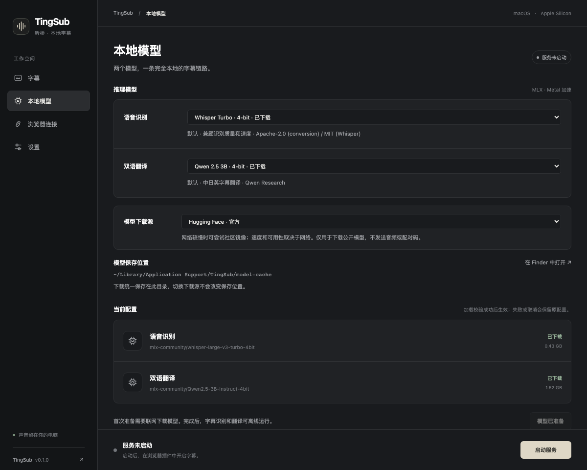

<p align="center"></p>

<p align="center">
  <a href="https://github.com/yeshan333/tingsub/actions/workflows/ci.yml"></a>
  <a href="LICENSE"></a>
  
  
</p>

<p align="center"><a href="README.md">English</a> · <strong>简体中文</strong></p>

# TingSub · 听桥

[产品主页](https://shansan.top/tingsub/) · [主页维护说明](docs/zh-CN/website.md)

把浏览器中播放的英语、日语实时变成**中文＋英文字幕**，识别与翻译都在你的 Mac 上完成。也可选择**中文＋原文**，保留日语原文。

TingSub 是面向 Apple Silicon 的早期 Chrome 扩展与本地 MLX 服务。它采集你选定的标签页，保持原声播放，在网页上显示可拖动的字幕，支持 YouTube 网页全屏，无需直播自带字幕。

**准备完成后，推理完全本地运行。** 无云 API、账号、音频上传、遥测或自动录音。安装依赖和首次下载模型需要联网；视频网站仍使用自己的网络连接。

> **许可范围：** TingSub 代码采用 MIT。默认 Qwen2.5-3B 翻译权重采用 **Qwen Research License**，有独立的使用限制，不属于 MIT 授权范围。使用或分发模型前请阅读[模型许可](docs/zh-CN/models.md)。

## 功能

- macOS 菜单栏：查看状态、启动/停止服务、打开模型与日志目录；关闭窗口后继续运行，从菜单退出。
- 英语／日语输入，支持逐片段自动识别语言。
- 可选识别草稿，中文先显示，再补齐双语字幕；也可关闭翻译，只显示识别原文。
- 桌面选择模型、查看下载进度，支持官方／社区镜像／自定义下载源，一键定位模型和日志。
- 有界队列及可见的过载、拒绝计数，避免推理变慢时不断累积延迟。
- 显示本段首字、首个中文、句尾延迟；通过本机配对码认证推理连接。
- 一次处理一个标签页，不使用麦克风。

桌面界面支持中英文；扩展界面和大部分运行提示仍为简体中文。用户与贡献者文档提供完整的**英文和简体中文**版本。界面语言不会改变字幕语言。

## 桌面窗口

直接下载 [macOS 应用](https://github.com/yeshan333/tingsub/releases/latest/download/TingSub-macos-arm64.dmg) · [Chrome 插件](https://github.com/yeshan333/tingsub/releases/latest/download/TingSub-extension.zip) · [版本说明](https://github.com/yeshan333/tingsub/releases/latest)。无需登录 GitHub；应用支持 Apple Silicon / macOS 15+，内嵌运行环境，尚未经过 Apple 公证。见[下载和安装说明](docs/zh-CN/distribution.md#下载-release)。

独立 App/DMG 内置运行环境和浏览器插件，无需安装 Python 或 uv。首次打开后在界面中选择、下载模型并配对 Chrome，见[桌面指南](docs/zh-CN/desktop.md)。当前构建尚未 Apple 公证；维护者构建方式见[分发指南](docs/zh-CN/distribution.md)。

### 产品截图

**字幕工作台**：预览字幕样式、选择语言、控制是否翻译，以及启动或停止本地服务。


**本地模型**：浏览识别和翻译模型、选择下载源、查看保存路径，并在 Finder 中打开模型目录。服务运行时也能浏览，停止后再应用新模型。



截图来自当前桌面界面，模型就绪状态和字幕文字用于展示，不代表真实转录或性能结果。在开发环境运行 `node scripts/capture-desktop.mjs` 可重新生成；需要 uv、npm 依赖及 Playwright Chromium。

下面是开发者从源码启动的方式：

```sh
uv run --frozen --extra desktop tingsub gui
```

也可双击 `gui.command`。首次使用、Dock 启动器及服务关闭行为见[桌面指南](docs/zh-CN/desktop.md)。

## 从源码快速开始

需要 **macOS 14+ 的 Apple Silicon Mac**、**Chrome 116+** 和 [uv](https://docs.astral.sh/uv/getting-started/installation/)。建议至少 16 GB 内存；两个默认模型快照约 2.2 GB，还需预留依赖与缓存空间。本版本不支持 Intel Mac、Windows、Linux 推理，也不支持 Firefox。

```sh
git clone https://github.com/yeshan333/tingsub.git
cd tingsub
uv sync --frozen --python 3.12
uv run --frozen tingsub prepare
uv run --frozen tingsub pair
uv run --frozen tingsub serve
```

保存 `pair` 输出的配对码，等待 `Application startup complete`，并保持终端运行。macOS 上也可依次运行 `./setup.command` 和 `./start.command`。

1. 打开 `chrome://extensions`，开启**开发者模式**，点击**加载已解压的扩展程序**，选择仓库中的 `extension/` 目录。
2. 固定 **TingSub · 听桥**，打开弹窗中的**本机配对**，粘贴配对码。
3. 播放直播，选择**英语**或**日语**，点击**为当前标签页开启字幕**。
4. 点击**停止**或字幕面板的 × 停止字幕。切换视频、刷新或关闭采集的标签页也会停止本次会话。

服务监听 `127.0.0.1:18765`。[安装指南](docs/zh-CN/installation.md)包含设置、更新和卸载步骤；连接失败可看[故障排查](docs/zh-CN/troubleshooting.md)。当前尚未提供 Chrome 商店版本或经过 Apple 公证的发行版。

## 工作方式


遇到停顿后提交音频；连续讲话约每 3 秒切段。识别草稿可提前显示；完整中文字段生成后，可先于英文译文显示。详见[架构与协议](docs/zh-CN/architecture.md)。

## 性能与限制

延迟受讲话长度、草稿开关、语言、GPU 负载和机器配置影响。句尾延迟**不等于**从开始讲话到看见字幕的等待时间。日语长句、多人重叠和背景音乐会降低准确率；强制切段可能切在词中间。被拒绝或过载跳过的片段会有提示，但不会生成译文。

仓库提供确定性的逻辑测试、独立浏览器检查，以及单独运行的**真实模型冒烟测试**。合成语音用例通过不能代表自然直播准确率。我们不承诺统一延迟或未经评测的词错率。详见[测量方法与当前限制](docs/zh-CN/benchmarks.md)。

## 文档

| 指南 | English | 简体中文 |
| --- | --- | --- |
| 桌面 GUI | [Read](docs/en/desktop.md) | [阅读](docs/zh-CN/desktop.md) |
| 文档索引 | [Read](docs/en/README.md) | [阅读](docs/zh-CN/README.md) |
| 安装、设置、更新、卸载 | [Read](docs/en/installation.md) | [阅读](docs/zh-CN/installation.md) |
| 故障排查 | [Read](docs/en/troubleshooting.md) | [阅读](docs/zh-CN/troubleshooting.md) |
| 架构与协议 | [Read](docs/en/architecture.md) | [阅读](docs/zh-CN/architecture.md) |
| 开发与测试 | [Read](docs/en/development.md) | [阅读](docs/zh-CN/development.md) |
| 性能与验证 | [Read](docs/en/benchmarks.md) | [阅读](docs/zh-CN/benchmarks.md) |
| 模型与第三方许可 | [Read](docs/en/models.md) | [阅读](docs/zh-CN/models.md) |
| 隐私 | [Read](docs/en/privacy.md) | [阅读](docs/zh-CN/privacy.md) |
| 贡献指南 | [Read](CONTRIBUTING.md) | [阅读](CONTRIBUTING.zh-CN.md) |
| 安全政策 | [Read](SECURITY.md) | [阅读](SECURITY.zh-CN.md) |
| 变更记录 | [Read](CHANGELOG.md) | [阅读](CHANGELOG.zh-CN.md) |

## 参与贡献

欢迎问题反馈、文档翻译，以及可复现的质量和性能改进。请先阅读[贡献指南](CONTRIBUTING.zh-CN.md)，同步维护对应的中英文文档。后续方向包括界面国际化、自然语音评测、改善分段和增加推理后端；这些是方向，不是交付承诺。

## 许可与致谢

代码采用 [MIT](LICENSE)，模型和依赖保留各自许可。感谢 [MLX](https://github.com/ml-explore/mlx)、[MLX Whisper](https://github.com/ml-explore/mlx-examples/tree/main/whisper)、[MLX LM](https://github.com/ml-explore/mlx-lm)、Whisper、Qwen、WebRTC VAD、FastAPI 和 Chrome 扩展 API。详见[模型与依赖说明](docs/zh-CN/models.md)。
