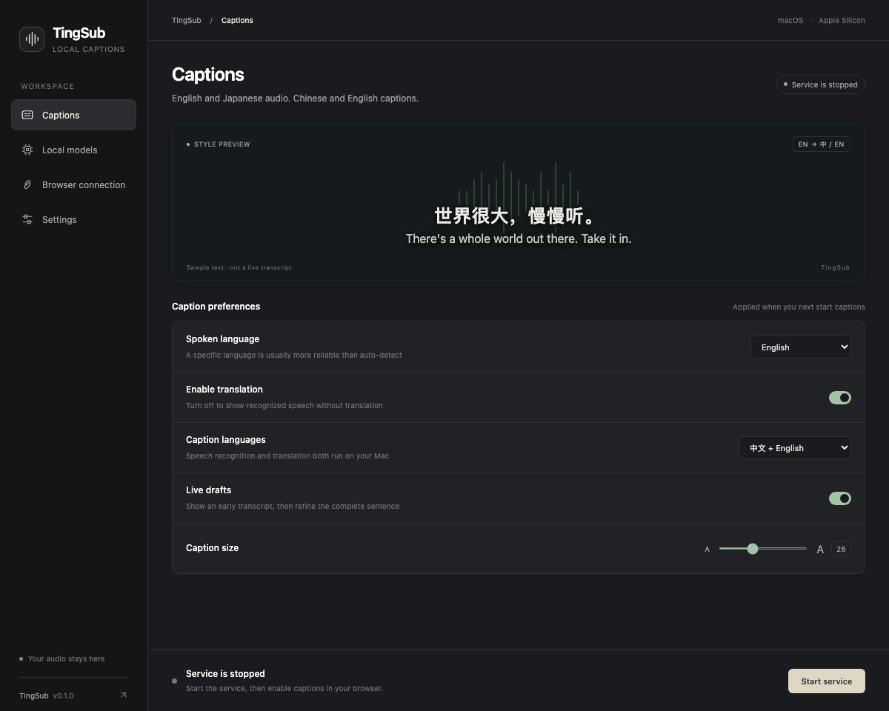

[English](../en/desktop.md) · [简体中文](../zh-CN/desktop.md) · [Index](README.md)

# Desktop workspace

Download the App/DMG from [GitHub Releases](https://github.com/yeshan333/tingsub/releases/latest) without signing in: see [Release download instructions](distribution.md#download-a-release).

TingSub offers a lightweight macOS window using the system WebKit renderer. The Python/MLX service still performs inference in a separate process. The desktop interface is available in English and Simplified Chinese, with dark, light and system appearance.



The caption preview uses authored sample text, not live transcription. Real captions appear on the selected browser page.

## Standalone app: no development tools required

Open `TingSub-0.1.0-macos-<minimum>-arm64.dmg`, drag TingSub to Applications, then open it. The app includes Python, MLX, WebKit integration and the browser extension. No Python, uv, Homebrew or source checkout is required. Use Apple Silicon and Chrome 116+. The minimum macOS version is included in the DMG filename and App metadata; the current locally tested build requires **macOS 26.2+**, and was tested on macOS 27. Models are downloaded on first use; an internet connection and several GB of free disk space are needed. Inference stays local after preparation.

1. **Local models:** choose one speech model and one translation model, then **Prepare models**. The app downloads, loads and warms up the pair before activating it. Cancel or retry from the same window.
2. **Browser connection:** open the extension folder and Chrome extensions. Enable Developer mode, choose Load unpacked and select the exported `extension` folder. Paste the pairing code into TingSub's extension.
3. **Start service:** wait for readiness, open your video tab and click Start captions in the extension.

Chrome requires explicit extension installation and a user gesture to capture a tab. Those steps cannot be silently automated. No Chrome Web Store listing is available yet. Exported extensions live outside the app and keep the same path across updates, preserving Chrome’s extension ID, pairing and settings. After replacing the App, click **Open extension folder** once to refresh the files, then click **Reload** on the existing TingSub entry in `chrome://extensions`; do not remove it or load a second copy. Older preview export folders are refreshed in place as well.

Current local/CI builds are **ad-hoc signed, not Apple-notarized**. They may trigger macOS security prompts when downloaded. A public notarized release requires a maintainer's Developer ID and Apple notarization. Do not describe a CI artifact as a notarized release.

### Switch models

You can browse and preselect models while the service runs. Stop the service before clicking **Download & apply**. Whisper Turbo / Small and Qwen 2.5 3B / 1.5B can be selected independently. Smaller models use less memory but may be less accurate; they are not automatically better for every input. See [model licenses](models.md).

A downloaded model is cached separately from the active configuration. The old pair stays active until the new pair successfully loads and translates a Japanese sample. Download/load failure or cancellation before activation retains the previous pair. Switching back to cached models works offline. A completed switch takes effect the next time you start the service. Validation is a compatibility check, not a general accuracy guarantee.

### Run from source

```sh
uv sync --frozen --extra desktop --python 3.12
uv run --frozen --extra desktop tingsub gui
```

`gui.command` and `scripts/create_desktop_app.py` remain development launchers that depend on the checkout. They are different from the standalone bundle. See [distribution](distribution.md) to build an App/DMG.

## Controls and lifecycle

- **Captions:** spoken language, caption languages, live drafts and font size. Changes are shared with the paired extension and apply when the next caption session starts. Stop and restart captions to apply them.
- **Local models:** download/readiness state, actual weight file sizes and recent process output. Download and inference cannot run simultaneously from this window. Use Cancel to stop an owned preparation/startup.
- **Browser connection:** extension folder, pairing code and installation guide. Copying a pairing code puts it on the system clipboard; the desktop does not display it in its page or logs.
- **Settings:** interface language and appearance. These preferences do not change speech or caption languages.

Closing the window stops the service or download **started by that window**, including an active caption session. A compatible service already started in a terminal is shown as external; this window never stops it. A service using a different pairing code, an older service without shared preferences, or another program on port 18765 is shown as a conflict. Stop it in its original window first. Preparing models after a cancelled download reuses the model cache.

Standalone app data lives in `~/Library/Application Support/TingSub`; source runs default to `.local`. Within that directory, settings live in `preferences.json` (captions) and `interface.json` (appearance); process output goes to `desktop.log`, replaced at the next start/preparation. Errors can include local file paths, so review logs before sharing. To use a custom data directory, place the global option before `gui`: `tingsub --data-dir PATH gui`. It must match the service's pairing and model directory.

With a pairing code configured, the extension durably retains edits while the service is unavailable. Before starting captions it retries those writes, then reads shared preferences. If retry fails, capture does not start with stale settings. Once synchronized, later desktop or extension edits take precedence. Old services without `/preferences` retain extension-only behavior. Reload the unpacked extension after updating this checkout.

## Current scope

Apple Silicon macOS only. No auto-update, tray mode or automatic tab capture. The existing terminal workflow remains supported. The extension UI and some process/error messages remain Chinese even when the desktop interface is English. See [development](development.md) for separate browser and native WebKit checks.

Desktop operations use a cross-process lock per data directory, preventing multiple windows from preparing models or overwriting logs/configuration concurrently. The child inherits the lock so an unexpected desktop exit does not permit a competing job.

## Model storage

**Local models → Model storage** shows the download cache for the current data directory. Click **Open in Finder** to open it, including while the service is running. Before the first download, the shortcut creates the empty cache folder.

The standalone default is `~/Library/Application Support/TingSub/model-cache`; source runs use `.local/model-cache`. A custom `--data-dir` uses `model-cache` beneath that directory. Switching download sources does not change this location or move existing models. The GUI does not offer a separate download destination.

## Download progress and sources

In **Local models**, choose official Hugging Face, the HF-Mirror community mirror, or a custom Hugging Face-compatible HTTPS endpoint before preparing models. The choice is saved locally for the next preparation.

Preparation has three stages: resolving file metadata, downloading, and loading/validation. Downloads show the current model, actual completed/total bytes, and a progress bar. Unknown file sizes use an indeterminate indicator. 100% means the files have downloaded; the active configuration changes only after model validation succeeds. Cancelling or failing keeps the previous pair and cached files can be reused on retry.

[HF-Mirror](https://hf-mirror.com/) may help on slow connections in China. It is a third-party community service; speed and availability vary. There is no automatic source switching. Audio, pairing codes, and Hugging Face login tokens are never sent to download sources; catalog models are public. Custom endpoints reject plain HTTP, embedded credentials, queries, and fragments.

CLI: `tingsub prepare --download-source mirror`, or `tingsub prepare --download-source custom --endpoint https://your-mirror.example`.

## Browser captions

Captions follow the visible video, leave room for bottom player controls, and support same-origin embedded players (including the tested Bilibili live page) and player fullscreen. They disappear when the video scrolls out of view. For cross-origin embedded players, captions stay in the permitted parent page and follow the iframe bounds; caption text is not injected into the foreign page. Fullscreen of a parent player container remains supported. Fullscreen entered inside the foreign iframe cannot show the parent overlay under Chrome active-tab permission limits.

One bilingual translation remains readable while the next recognition draft is marked as in progress. Each language has its own two-line area for long text, with independent scrolling and an expand button. Hover over captions to drag the toolbar, recenter, open runtime information, or stop captions. Timing and statistics are collapsed by default.

When recognition already matches a displayed language, that text is reused verbatim. English speech generates only Chinese. Chinese speech generates only English in Chinese + English mode, and skips translation entirely in Chinese + Original mode, showing Chinese once. Automatic language mode uses each segment’s recognized language. Speech recognition still runs, and Japanese-to-Chinese/English remains unchanged.

Turn off **Enable translation** in desktop caption preferences or the extension to show recognized speech only on the next caption session. Re-enable it to restore the selected target languages. The switch defaults to on and is synchronized between both interfaces. Model selection is unchanged: service startup still loads the selected pair, but caption sessions skip translation calls. An older service without toggle support is rejected with an upgrade message rather than silently ignoring the setting.

For debugging, use **Show log file in Finder** beside the process log on the **Local models** page. It selects `desktop.log` in the current data directory. Before a log exists, it opens the directory without creating an empty file. The log is overwritten when starting the service or preparing models; copy it first if you need to preserve a failure report.
