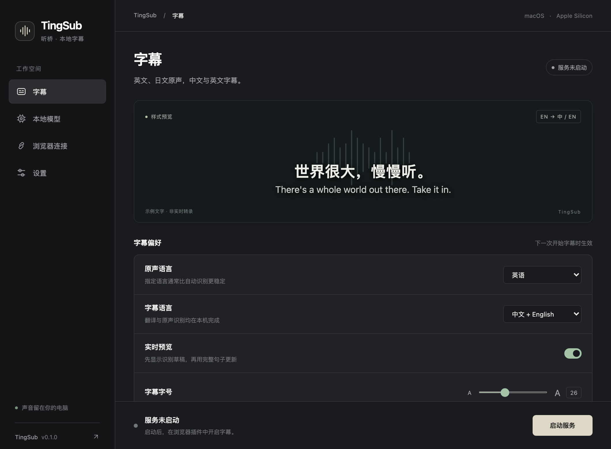

[English](../en/desktop.md) · [简体中文](../zh-CN/desktop.md) · [Index](README.md)

# Desktop workspace

TingSub offers a lightweight macOS window using the system WebKit renderer. The Python/MLX service still performs inference in a separate process. The desktop interface is available in English and Simplified Chinese, with dark, light and system appearance.



The caption preview uses authored sample text, not live transcription. Real captions appear on the selected browser page.

## Standalone app: no development tools required

Open `TingSub-0.1.0-macos-<minimum>-arm64.dmg`, drag TingSub to Applications, then open it. The app includes Python, MLX, WebKit integration and the browser extension. No Python, uv, Homebrew or source checkout is required. Use Apple Silicon and Chrome 116+. The minimum macOS version is included in the DMG filename and App metadata; the current locally tested build requires **macOS 26.2+**, and was tested on macOS 27. Models are downloaded on first use; an internet connection and several GB of free disk space are needed. Inference stays local after preparation.

1. **Local models:** choose one speech model and one translation model, then **Prepare models**. The app downloads, loads and warms up the pair before activating it. Cancel or retry from the same window.
2. **Browser connection:** open the extension folder and Chrome extensions. Enable Developer mode, choose Load unpacked and select the exported `extension` folder. Paste the pairing code into TingSub's extension.
3. **Start service:** wait for readiness, open your video tab and click Start captions in the extension.

Chrome requires explicit extension installation and a user gesture to capture a tab. Those steps cannot be silently automated. No Chrome Web Store listing is available yet. Exported extensions live outside the app and survive app replacement; after an extension update, load the newly exported folder and remove the older extension.

Current local/CI builds are **ad-hoc signed, not Apple-notarized**. They may trigger macOS security prompts when downloaded. A public notarized release requires a maintainer's Developer ID and Apple notarization. Do not describe a CI artifact as a notarized release.

### Switch models

Stop the service, select models and click **Download & apply**. Whisper Turbo / Small and Qwen 2.5 3B / 1.5B can be selected independently. Smaller models use less memory but may be less accurate; they are not automatically better for every input. See [model licenses](models.md).

A downloaded model is cached separately from the active configuration. The old pair stays active until the new pair successfully loads and translates a Japanese sample. Download/load failure or cancellation before activation retains the previous pair. Switching back to cached models works offline. A completed switch takes effect the next time you start the service. Validation is a compatibility check, not a general accuracy guarantee.

### Run from source

```sh
uv sync --frozen --extra desktop --python 3.12
uv run --frozen --extra desktop tingsub gui
```

`gui.command` and `scripts/create_desktop_app.py` remain development launchers that depend on the checkout. They are different from the standalone bundle. See [distribution](distribution.md) to build an App/DMG.

## Controls and lifecycle

- **Captions:** spoken language, caption languages, live drafts and font size. Changes are shared with the paired extension and apply when the next caption session starts. Stop and restart captions to apply them.
- **Local models:** download/readiness state, actual weight file sizes and recent process output. Download and inference cannot run simultaneously from this window. Use Cancel to stop an owned preparation/startup.
- **Browser connection:** extension folder, pairing code and installation guide. Copying a pairing code puts it on the system clipboard; the desktop does not display it in its page or logs.
- **Settings:** interface language and appearance. These preferences do not change speech or caption languages.

Closing the window stops the service or download **started by that window**, including an active caption session. A compatible service already started in a terminal is shown as external; this window never stops it. A service using a different pairing code, an older service without shared preferences, or another program on port 18765 is shown as a conflict. Stop it in its original window first. Preparing models after a cancelled download reuses the model cache.

Standalone app data lives in `~/Library/Application Support/TingSub`; source runs default to `.local`. Within that directory, settings live in `preferences.json` (captions) and `interface.json` (appearance); process output goes to `desktop.log`, replaced at the next start/preparation. Errors can include local file paths, so review logs before sharing. To use a custom data directory, place the global option before `gui`: `tingsub --data-dir PATH gui`. It must match the service's pairing and model directory.

With a pairing code configured, the extension durably retains edits while the service is unavailable. Before starting captions it retries those writes, then reads shared preferences. If retry fails, capture does not start with stale settings. Once synchronized, later desktop or extension edits take precedence. Old services without `/preferences` retain extension-only behavior. Reload the unpacked extension after updating this checkout.

## Current scope

Apple Silicon macOS only. No auto-update, tray mode or automatic tab capture. The existing terminal workflow remains supported. The extension UI and some process/error messages remain Chinese even when the desktop interface is English. See [development](development.md) for separate browser and native WebKit checks.

Desktop operations use a cross-process lock per data directory, preventing multiple windows from preparing models or overwriting logs/configuration concurrently. The child inherits the lock so an unexpected desktop exit does not permit a competing job.
