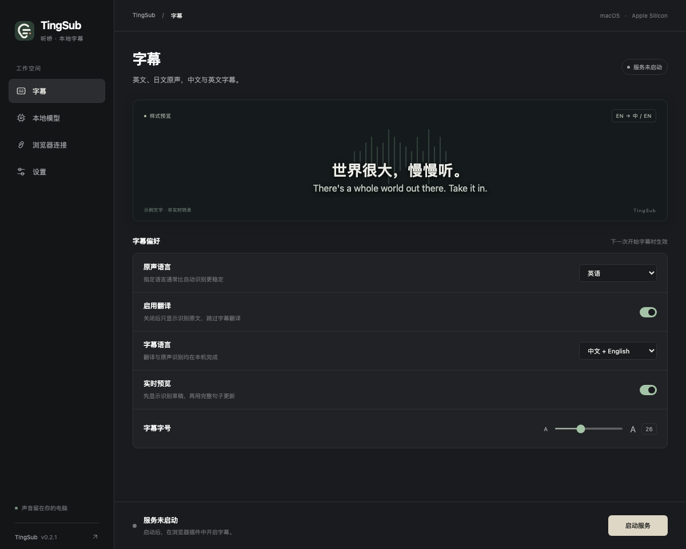

[English](../en/desktop.md) · [简体中文](../zh-CN/desktop.md) · [索引](README.md)

# 桌面工作空间

从 [GitHub Release](https://github.com/yeshan333/tingsub/releases/latest) 下载 App/DMG，无需登录，见 [Release 下载说明](distribution.md#下载-release)。

TingSub 提供使用系统 WebKit 渲染的轻量 macOS 窗口，推理仍由独立的 Python／MLX 服务进程完成。桌面界面支持简体中文、英文，以及深色、浅色和跟随系统的外观。



字幕预览使用预先编写的示例文字，不是实时转录。真实字幕显示在选定的浏览器页面上。

## 独立应用：不需要开发环境

打开 `TingSub-macos-arm64.dmg`，将 TingSub 拖入 Applications，再打开应用。安装包包含 Python、MLX、WebKit 集成和浏览器插件，不需要另装 Python、uv、Homebrew 或下载源码。需要 Apple Silicon、**macOS 15+** 和 Chrome 116+；每个版本的具体系统要求见 Release 说明或应用元数据。本机构建的包可能要求更高系统版本，见[构建说明](distribution.md#本地构建)。首次使用需要联网下载模型，并预留数 GB 磁盘空间；准备后推理完全在本机运行。

1. **本地模型：** 分别选择识别和翻译模型，点击**准备模型**。应用下载后会实际加载、预热，通过后才激活；过程中可取消，失败可重试。
2. **浏览器连接：** 打开插件文件夹和 Chrome 扩展管理页，开启开发者模式，点击「加载已解压的扩展程序」并选择导出的 `extension` 文件夹，再在插件中粘贴配对码。
3. **启动服务：** 等待模型就绪，打开视频标签页，在插件中点击「开始字幕」。

Chrome 要求用户主动安装插件、开启标签页采集，这两步不能静默代办。目前没有 Chrome 商店版本。导出的插件位于应用外部，更新时保持原路径，保留 Chrome 插件 ID、配对和设置。替换 App 后点击一次「打开插件文件夹」更新导出文件，再到 `chrome://extensions` 对已有 TingSub 点击「重新加载」，不要移除旧条目或另装一份。早期预览版导出的版本目录也会原地更新。

当前本地和 CI 构建是 **ad-hoc 签名，尚未经过 Apple 公证**，下载后可能遇到 macOS 安全提示。公开分发的公证版本需要维护者配置 Developer ID 和 Apple 公证；CI 制品不能宣称为已公证发行版。

### 切换模型

服务运行时也可浏览和预选模型；停止服务后再点击**下载并应用**。识别模型可选 Whisper Turbo / Small，翻译模型可选 Qwen 2.5 3B / 1.5B，可以自由组合。小模型更省内存，准确率可能下降，不代表所有输入都会更快、更好。使用前请查看[模型许可](models.md)。

下载缓存与当前配置分别保存。新组合成功加载并完成日语样例翻译后，才替换当前配置；下载、加载失败或激活前取消会保留旧配置。切回已缓存的模型无需联网，完成切换后在下次启动服务时生效。加载验证只检查兼容性，不代表普遍准确率保证。

### 从源码启动

```sh
uv sync --frozen --extra desktop --python 3.12
uv run --frozen --extra desktop tingsub gui
```

`gui.command` 和 `scripts/create_desktop_app.py` 仍保留为依赖源码目录的开发启动器，与独立安装包不同。构建 App/DMG 见[分发指南](distribution.md)。

## 控件与服务生命周期

- **字幕：** 原声语言、字幕语言、实时草稿和字号。与已配对插件共享设置，在下一次开始字幕时生效；已有会话需停止后重新开始。
- **本地模型：** 下载／文件就绪状态、实际权重文件大小和最近的进程输出。同一窗口不能同时下载和运行推理；准备或启动期间可以取消。
- **浏览器连接：** 打开插件目录、复制配对码及查看安装指南。复制会把配对码放入系统剪贴板，桌面页面和日志中不显示配对码。
- **设置：** 界面语言和外观，不影响原声或字幕语言。

关闭窗口会停止**由此窗口启动**的服务或下载，包括正在进行的字幕会话。已从终端启动的兼容服务会显示为外部服务，桌面窗口不会停止它。使用其他配对码的服务、不支持共享设置的旧服务，或占用 18765 端口的其他程序会显示为端口冲突，请先在原窗口停止。取消下载后再次准备模型会复用模型缓存。

独立应用的数据位于 `~/Library/Application Support/TingSub`，源码运行默认使用 `.local`。目录内 `preferences.json` 保存字幕偏好，`interface.json` 保存界面偏好。进程输出写入 `desktop.log`，下次启动服务或准备模型时覆盖。错误可能包含本地路径，分享前请检查日志。自定义数据目录时，把全局参数放在 `gui` 前：`tingsub --data-dir PATH gui`，必须与服务的配对和模型目录一致。

已填写配对码后，即使服务暂时停止，插件也会持久保存待同步修改；下次开始字幕前先重试写入服务，再读取共享设置。重试失败时不会用旧参数开始采集。已同步的参数以后续桌面／插件修改为准。没有 `/preferences` 的旧服务仍使用插件独立设置。更新项目后请重新加载已解压的插件。

## 当前范围

仅支持 Apple Silicon macOS。暂未提供自动更新、托盘模式或自动采集标签页；原有终端启动方式继续可用。即使桌面界面切换为英文，插件界面和部分进程／错误消息仍为中文。浏览器和原生 WebKit 的独立验证方法见[开发文档](development.md)。

同一数据目录的桌面操作使用跨进程文件锁，避免多个窗口同时准备模型并覆盖日志或配置。子进程继承锁，桌面意外退出后也不会允许另一个窗口并行写入。

## 模型保存位置

「本地模型 → 模型保存位置」显示当前数据目录下的下载缓存路径，点击「在 Finder 中打开」即可跳转，服务运行时也可使用。首次下载前会创建并打开空缓存目录。

独立应用默认使用 `~/Library/Application Support/TingSub/model-cache`，源码运行默认使用 `.local/model-cache`；指定 `--data-dir` 后使用该目录下的 `model-cache`。切换下载源不会改变保存位置或移动已有模型，界面不提供单独的下载目标路径设置。

## 下载进度与下载源

在「本地模型」选择官方 Hugging Face、HF-Mirror 社区镜像或自定义兼容 Hugging Face 的 HTTPS 地址，再点击「准备模型」或「下载并应用」。所选地址会保存在本机，供下次准备使用。

准备分为获取文件信息、下载、加载校验三步。下载期间显示当前模型、实际已下载/总大小和进度条；文件大小未知时显示不定进度。100% 仅表示文件下载完成，加载校验通过后才切换配置。取消或失败会保留原配置，已缓存文件可供重试复用。

国内网络较慢时可尝试 [HF-Mirror](https://hf-mirror.com/)。这是第三方社区服务，速度和可用性取决于网络，不保证比官方快。TingSub 不自动切换源，不向下载源发送音频、配对码或 Hugging Face 登录令牌；当前内置模型均可匿名下载。自定义地址不接受明文 HTTP、嵌入凭据、查询参数或片段。

CLI 同样支持 `tingsub prepare --download-source mirror`，或 `tingsub prepare --download-source custom --endpoint https://your-mirror.example`。

## 浏览器字幕

字幕自动跟随可见视频，给底部播放器控件留出空间；支持同源嵌入播放器（包括 B 站该直播页）和播放器全屏。视频滚出页面时字幕随之隐藏。跨域嵌入播放器的字幕留在获准访问的父页面，按 iframe 边界定位，不把字幕文字注入跨域子页面。父页面播放器容器进入全屏仍可显示；若在跨域 iframe 内部进入全屏，受 Chrome 当前标签页权限限制，父页面字幕无法覆盖。

默认显示一组双语译文，下一句识别草稿用「识别中」标记。长句中英文各自保留两行空间，可独立滚动，并可点击「展开长句」。鼠标移入字幕可拖动顶栏、「归位」、查看「信息」或停止字幕；延迟和运行统计默认折叠。

识别语言与显示语言一致时直接保留识别原文：英语原声只生成中文，中文原声在「中文＋英文」中只生成英文，在「中文＋原文」中跳过翻译并只显示一份中文。自动识别使用每段识别结果的语言；这不会跳过语音识别，也不改变日语转中英双语的流程。

在桌面「字幕偏好」或浏览器插件关闭「启用翻译」，下一次开启字幕时只识别并显示原文；重新开启可恢复之前选择的目标语言。开关默认开启，两边同步保存。关闭开关不会修改模型选择；服务启动仍会加载当前模型组合，但字幕会话不会调用翻译。旧版服务不支持此开关时会提示更新，而不会忽略关闭设置。

遇到问题时，在「本地模型」页点击日志旁的「在 Finder 中显示日志文件」，可直接选中当前数据目录的 `desktop.log`。尚未生成日志时会打开所在目录，不创建空日志。日志在每次启动服务或准备模型时覆盖，排查前可先复制保存。
